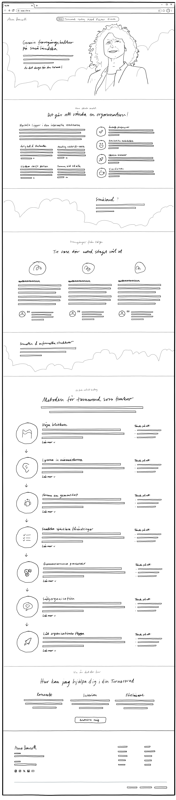

# Anna Bansell Consulting - Strategic Digital Presence

> **Transform organizational turnaround expertise into scalable business growth through multi-purpose digital engagement serving business evaluation, speaking opportunities, and educational research needs.**

## [Project Brief](docs/A-Product-Brief/01-Product-Brief.md)

**Market Gap**: Mid-market Swedish companies face organizational challenges but distrust expensive, process-heavy consulting firms from large agencies.

**Solution**: Cultural positioning as trusted Småland consultant with informal structure methodology, providing practical results-oriented organizational change through proven regional expertise.

**Unique Differentiation**: "Frugal, religious, hard to fool" Småland values create sustainable competitive advantage against generic consulting approaches while serving diverse stakeholder needs simultaneously.

## [StartPage Design Concept](docs/C-Scenarios/01-Browse-Website/1.1-StartPage/1.1-StartPage.md)

**Visual Foundation**: Desktop concept sketch demonstrates professional one-page architecture with floating navigation, bilingual language switching, and seven-step methodology presentation including Anna's sales organization expertise.

**Key Design Elements**: Floating navigation system, integrated language switcher for Swedish-English content management, comprehensive method section with expanded sales organization step, and professional layout optimized for consulting business credibility.

## [Trigger Map](docs/B-Trigger-Map/01-Trigger-Map.md)

```mermaid
flowchart LR
    %% Business Goals (Left Side)
    B1["💚 Professional Credibility<br/>Trusted Småland Consultant<br/>3-5 monthly inquiries<br/>LinkedIn network growth<br/>Speaking opportunities"]
    B2["📈 Revenue Growth<br/>Sustainable Business Expansion<br/>20% billable hours increase<br/>Premium pricing capability<br/>Client retention improvement"]
    B3["🗺️ Regional Leadership<br/>Småland Business Authority<br/>Local business recognition<br/>Media coverage interviews<br/>Peer referrals"]
    
    %% Central Platform (Middle)
    A["🎯 BANSELL.SE<br/>Swedish Consulting Website<br/>Organizational Turnaround Expertise<br/>Småland Regional Focus"]
    
    %% Target Groups (Right Side)
    C1["👔 Nils Netrepreneur<br/>Business Owner/Manager<br/>Organizational Turnaround Needs<br/>Evaluating Interim Solutions"]
    C2["🎤 Eva Event-Organizer<br/>Conference/Event Coordinator<br/>Seeking Business Speakers<br/>Company Turnaround Focus"]
    C3["📚 Sam Student<br/>Leadership Researcher<br/>Academic/Professional Learning<br/>Google Search Discovery"]
    
    %% Usage Goals
    C1P["✅ NILS WANTS:<br/>Interim sales manager evaluation<br/>Turnaround expertise validation<br/>Regional business understanding<br/>Proven methodology access"]
    C1N["❌ NILS FEARS:<br/>Wrong advisor selection<br/>Costly consulting mistakes<br/>Cultural misfit solutions<br/>Unproven approaches"]
    
    C2P["✅ EVA WANTS:<br/>Engaging business speakers<br/>Turnaround success stories<br/>Professional presentation skills<br/>Audience-relevant content"]
    C2N["❌ EVA FEARS:<br/>Boring speaker selection<br/>Irrelevant content delivery<br/>Professional reputation risk<br/>Audience disappointment"]
    
    C3P["✅ SAM WANTS:<br/>Leadership principle insights<br/>Research material access<br/>Practical case studies<br/>Academic credibility sources"]
    C3N["❌ SAM FEARS:<br/>Unreliable information sources<br/>Academic irrelevance<br/>Incomplete research data<br/>Theoretical disconnection"]

    %% Connections: Business Goals → Platform
    B1 --> A
    B2 --> A
    B3 --> A
    
    %% Connections: Platform → Target Groups
    A --> C1
    A --> C2
    A --> C3
    
    %% Connections: Target Groups → Usage Goals
    C1 --> C1P
    C1 --> C1N
    C2 --> C2P
    C2 --> C2N
    C3 --> C3P
    C3 --> C3N

    %% Professional styling
    classDef businessGoal fill:#f3f4f6,color:#000000,stroke:#d1d5db,stroke-width:3px
    classDef platform fill:#e5e7eb,color:#000000,stroke:#d1d5db,stroke-width:4px
    classDef targetGroup fill:#f9fafb,color:#000000,stroke:#d1d5db,stroke-width:2px
    classDef positiveGoals fill:#f3f4f6,color:#000000,stroke:#d1d5db,stroke-width:2px
    classDef negativeGoals fill:#f3f4f6,color:#000000,stroke:#d1d5db,stroke-width:2px

    class B1,B2,B3 businessGoal
    class A platform
    class C1,C2,C3 targetGroup
    class C1P,C2P,C3P positiveGoals
    class C1N,C2N,C3N negativeGoals
```

---

## Quick Navigation

### 📋 **Strategic Foundation**
→ **[Product Brief](docs/A-Product-Brief/01-Product-Brief.md)** - Technical requirements and business scope  
→ **[Trigger Map](docs/B-Trigger-Map/01-Trigger-Map.md)** - Persona analysis and business goals  

### 🎯 **User Experience Design**
→ **[User Journey Scenarios](docs/C-Scenarios/00-User-Scenarios.md)** - Complete persona flow mapping  
→ **[StartPage Specification](docs/C-Scenarios/01-Browse-Website/1.1-StartPage/1.1-StartPage.md)** - Landing page specifications  

### 📊 **Project Management**
→ **[Change Log](CHANGELOG.md)** - Development impact tracking  
→ **[Project Progress](CHANGELOG.md#previous-session-documentation---earlier-2025-09-02)** - Current status and next steps

---

## [Strategic Considerations](docs/B-Trigger-Map/01-Trigger-Map.md#detailed-component-analysis)

### Primary Revenue Drivers
**Nils Netrepreneur represents 70% development focus** - Business owners with immediate organizational turnaround needs generate direct consulting revenue through interim advisor evaluation and engagement.

### Network Effects and Cross-Pollination
**Eva Event-Organizer provides credibility amplification** - Speaking engagements build professional authority that strengthens Nils's confidence in Anna's expertise while creating referral opportunities across Swedish business community.

**Sam Student enables thought leadership** - Educational content consumption validates methodology credibility, supporting both business evaluation and speaker assessment processes through research-quality documentation.

### Competitive Advantages
**Cultural Positioning**: Småland identity creates trust barriers against large consulting firms while enabling premium pricing through regional expertise specialization.

**Multi-Purpose Architecture**: Single website serves three distinct stakeholder types, maximizing reach while maintaining focused messaging for each persona's specific motivations and concerns.

**Informal Structure Methodology**: Proven "color on the bottom row" approach provides concrete differentiation against generic change management consulting.

## [Strategic Foundation Documentation](CHANGELOG.md)

### Project Foundation
**[Product Brief](docs/A-Product-Brief/01-Product-Brief.md)** - Technical requirements, platform architecture, and implementation scope with BMad methodology validation framework.

### User Research Intelligence
**[Trigger Map Analysis](docs/B-Trigger-Map/01-Trigger-Map.md)** - Complete business goals breakdown, persona deep dive with usage motivations, and strategic implementation priorities.

### Implementation Specifications
**[User Journey Scenarios](docs/C-Scenarios/00-User-Scenarios.md)** - Comprehensive user journey narratives for all three personas with complete value flow mapping and cross-scenario connections.

**[StartPage Specification](docs/C-Scenarios/01-Browse-Website/1.1-StartPage/1.1-StartPage.md)** - Detailed page section architecture, content strategy integration, and user interaction specifications for primary landing page.

## [Project Status & Methodology Validation](CHANGELOG.md#previous-session-documentation---earlier-2025-09-02)

### Current Phase: Strategic Foundation Complete ✅
- **Product Brief**: Technical scope and strategic alignment established
- **Trigger Map**: Business goals and persona analysis documented with visual strategy map
- **Documentation Standards**: WPS2C compliance with professional naming conventions implemented

### Current Phase: Scenario Development Complete ✅
- **User Journey Scenarios**: Complete persona flow mapping with value exchange documentation
- **Cross-Scenario Connections**: How different user journeys intersect and amplify business value
- **Technical Implications**: API requirements, performance standards, and security considerations identified

### Next Phase: Component Specifications
- **Component Architecture**: Section-based design system for one-page implementation
- **Development Handoff**: Technical specifications for React component implementation
- **Content Integration**: Swedish content strategy with bilingual expansion planning

### Dual Purpose Initiative
This project serves both **Anna's business objectives** and **Whiteport's methodology validation**, demonstrating sophisticated WPS2C brownfield integration with BMad Method acceleration for real-world consulting business requirements.

---

## [Project Progress & Change Log](CHANGELOG.md)

**Latest Updates**: Strategic foundation documentation complete with comprehensive structured implementation  
**Development Status**: Ready for component specification and implementation planning  
**Methodology Validation**: Brownfield project demonstrating sophisticated development workflow integration

---

**Documentation Standard**: Professional conventions with enterprise naming standards  
**Strategic Approach**: Multi-purpose digital presence serving business evaluation, speaking engagement, and educational research stakeholder needs