# Anna Bansell Consulting - Strategic Digital Presence

> **Transform organizational turnaround expertise into scalable business growth through multi-purpose digital engagement serving business evaluation, speaking opportunities, and educational research needs.**

## Strategic Vision

**Market Gap**: Mid-market Swedish companies face organizational challenges but distrust expensive, process-heavy consulting firms from large agencies.

**Solution**: Cultural positioning as trusted Småland consultant with informal structure methodology, providing practical results-oriented organizational change through proven regional expertise.

**Unique Differentiation**: "Frugal, religious, hard to fool" Småland values create sustainable competitive advantage against generic consulting approaches while serving diverse stakeholder needs simultaneously.

## Strategic Trigger Map

```mermaid
flowchart LR
    %% Business Goals (Left Side)
    B1["💚 Professional Credibility<br/>Trusted Småland Consultant<br/>3-5 monthly inquiries<br/>LinkedIn network growth<br/>Speaking opportunities"]
    B2["📈 Revenue Growth<br/>Sustainable Business Expansion<br/>20% billable hours increase<br/>Premium pricing capability<br/>Client retention improvement"]
    B3["🗺️ Regional Leadership<br/>Småland Business Authority<br/>Local business recognition<br/>Media coverage interviews<br/>Peer referrals"]
    
    %% Central Platform (Middle)
    A["🎯 BANSELL.SE<br/>Swedish Consulting Website<br/>Organizational Turnaround Expertise<br/>Småland Regional Focus"]
    
    %% Target Groups (Right Side)
    C1["👔 Nils Netrepreneur<br/>Business Owner/Manager<br/>Organizational Turnaround Needs<br/>Evaluating Interim Solutions"]
    C2["🎤 Eva Event-Organizer<br/>Conference/Event Coordinator<br/>Seeking Business Speakers<br/>Company Turnaround Focus"]
    C3["📚 Sam Student<br/>Leadership Researcher<br/>Academic/Professional Learning<br/>Google Search Discovery"]
    
    %% Usage Goals
    C1P["✅ NILS WANTS:<br/>Interim sales manager evaluation<br/>Turnaround expertise validation<br/>Regional business understanding<br/>Proven methodology access"]
    C1N["❌ NILS FEARS:<br/>Wrong advisor selection<br/>Costly consulting mistakes<br/>Cultural misfit solutions<br/>Unproven approaches"]
    
    C2P["✅ EVA WANTS:<br/>Engaging business speakers<br/>Turnaround success stories<br/>Professional presentation skills<br/>Audience-relevant content"]
    C2N["❌ EVA FEARS:<br/>Boring speaker selection<br/>Irrelevant content delivery<br/>Professional reputation risk<br/>Audience disappointment"]
    
    C3P["✅ SAM WANTS:<br/>Leadership principle insights<br/>Research material access<br/>Practical case studies<br/>Academic credibility sources"]
    C3N["❌ SAM FEARS:<br/>Unreliable information sources<br/>Academic irrelevance<br/>Incomplete research data<br/>Theoretical disconnection"]

    %% Connections: Business Goals → Platform
    B1 --> A
    B2 --> A
    B3 --> A
    
    %% Connections: Platform → Target Groups
    A --> C1
    A --> C2
    A --> C3
    
    %% Connections: Target Groups → Usage Goals
    C1 --> C1P
    C1 --> C1N
    C2 --> C2P
    C2 --> C2N
    C3 --> C3P
    C3 --> C3N

    %% Professional styling
    classDef businessGoal fill:#f3f4f6,color:#000000,stroke:#d1d5db,stroke-width:3px
    classDef platform fill:#e5e7eb,color:#000000,stroke:#d1d5db,stroke-width:4px
    classDef targetGroup fill:#f9fafb,color:#000000,stroke:#d1d5db,stroke-width:2px
    classDef positiveGoals fill:#f3f4f6,color:#000000,stroke:#d1d5db,stroke-width:2px
    classDef negativeGoals fill:#f3f4f6,color:#000000,stroke:#d1d5db,stroke-width:2px

    class B1,B2,B3 businessGoal
    class A platform
    class C1,C2,C3 targetGroup
    class C1P,C2P,C3P positiveGoals
    class C1N,C2N,C3N negativeGoals
```



## Strategic Insights from User Research

### Primary Revenue Drivers
**Nils Netrepreneur represents 70% development focus** - Business owners with immediate organizational turnaround needs generate direct consulting revenue through interim advisor evaluation and engagement.

### Network Effects and Cross-Pollination
**Eva Event-Organizer provides credibility amplification** - Speaking engagements build professional authority that strengthens Nils's confidence in Anna's expertise while creating referral opportunities across Swedish business community.

**Sam Student enables thought leadership** - Educational content consumption validates methodology credibility, supporting both business evaluation and speaker assessment processes through research-quality documentation.

### Competitive Advantages
**Cultural Positioning**: Småland identity creates trust barriers against large consulting firms while enabling premium pricing through regional expertise specialization.

**Multi-Purpose Architecture**: Single website serves three distinct stakeholder types, maximizing reach while maintaining focused messaging for each persona's specific motivations and concerns.

**Informal Structure Methodology**: Proven "color on the bottom row" approach provides concrete differentiation against generic change management consulting.

## Market Opportunity & Business Case

### Market Gap Analysis
**Problem**: Swedish mid-market companies distrust large consulting firms due to cultural disconnect and process-heavy approaches, yet organizational transformation needs continue growing 5-8% annually.

**Opportunity**: Regional positioning with proven methodology fills gap between expensive enterprise consulting and generic business advice.

### Strategic Advantages
**Timing**: Growing skepticism toward large consulting firms creates competitive opportunity for culturally-aligned alternatives.

**Scalability**: Multi-purpose digital presence enables simultaneous business development, speaking engagement opportunities, and thought leadership positioning without additional marketing infrastructure.

**Sustainability**: Cultural positioning and proven methodology create defensible market position while speaking engagements amplify credibility and referral generation.

### Revenue Model Resilience
**Primary Stream**: Direct consulting from business evaluation engagement through Nils persona targeting.

**Secondary Stream**: Speaking fees and professional recognition through Eva persona engagement.

**Long-term Stream**: Thought leadership and referral generation through educational content engagement via Sam persona.

## Technical Foundation

### Documentation Architecture
```
docs/
├── A-Product-Brief/           # Technical requirements and project scope
│   └── 01-Product-Brief.md
├── B-Trigger-Map/            # Strategic analysis and persona definitions
│   └── 01-Trigger-Map.md
└── C-Scenarios/              # User interaction specifications
    └── 01-Browse-Website/
        └── 1.1-StartPage/
            ├── 1.1-StartPage-Synopsis.md
            └── Sketches/
                └── 01-StartPage_Desktop_Concept.jpg
```

### Application Structure
```
src/
├── components/               # Page section components
│   ├── HeroSection.tsx      # Primary landing section
│   ├── MethodSection.tsx    # Methodology explanation
│   ├── ServicesSection.tsx  # Service offerings
│   ├── ContactSection.tsx   # Contact and engagement
│   └── ui/                  # Reusable UI components
├── pages/                   # Route components
└── lib/                     # Utilities and configuration
```

## Technical Stack

**Frontend Framework**: React 18 with TypeScript  
**Build Tool**: Vite for optimal development experience  
**Styling**: Tailwind CSS with shadcn-ui components  
**Deployment**: Vercel with future serverless capability  
**Content Strategy**: Manual bilingual implementation for Swedish/English support

## Development Methodology

**Primary Method**: Whiteport Sketch-to-Code WPS2C workflow  
**Enhancement**: BMad Method expansion pack for AI-assisted development  
**Architecture**: Section-based design for one-page website implementation  
**Standards**: Zero Tolerance Parentheses Policy and Title-Case-With-Dashes naming

### WPS2C Workflow Phases
1. **✅ Product Brief**: Technical scope and strategic alignment - [View Document](docs/A-Product-Brief/01-Product-Brief.md)
2. **✅ Trigger Map**: Business goals and persona analysis - [View Document](docs/B-Trigger-Map/01-Trigger-Map.md)
3. **🚧 Scenarios**: User interaction specifications and page section design
4. **⏳ Implementation**: React component development with BMad acceleration
5. **⏳ Optimization**: Performance tuning and conversion optimization

## Getting Started

### Prerequisites
- Node.js 18+ with npm package manager
- Git for version control
- VS Code or preferred IDE with TypeScript support

### Local Development
```bash
# Clone the repository
git clone <repository-url>
cd anna-bansell-hemsida

# Install dependencies
npm install

# Start development server
npm run dev

# Open browser to http://localhost:5173
```

### Build Commands
```bash
# Development build with hot reload
npm run dev

# Production build
npm run build

# Preview production build
npm run preview

# Type checking
npm run type-check

# Linting
npm run lint
```

## Project Context

### Brownfield Integration
This project leverages an existing React/Vite foundation while implementing comprehensive WPS2C specifications through reverse engineering methodology.

### Methodology Validation
Serves dual purpose as Anna's business tool and Whiteport's WPS2C methodology validation with BMad Method integration testing.

### Cultural Positioning
Emphasizes Småland values of "frugal, religious, hard to fool" as competitive differentiation against large consulting firms.

## Documentation Standards

**Naming Convention**: Title-Case-With-Dashes for files and folders  
**Structure Standards**: Professional folder organization with clear hierarchy  
**Content Policy**: Zero tolerance for parentheses explanations - use professional alternatives  
**Link Strategy**: Headlines contain reference links for cross-document navigation

## Success Metrics

**Technical Performance**: Core Web Vitals optimization and accessibility compliance  
**User Experience**: Multi-persona layout effectiveness and conversion optimization  
**Business Impact**: Consultation inquiries, speaking engagements, and professional credibility enhancement  
**Strategic Validation**: Achievement of trigger map business goals and persona engagement

---

**Created by**: Whiteport Business Analyst using BMad Method + Whiteport Sketch-to-Code expansion  
**Documentation Standard**: WPS2C methodology with professional naming conventions  
**Last Updated**: Current session with trigger map integration and product brief synchronization