**[← Back to Project Overview](../../README.md)** | **[Product Brief](../A-Product-Brief/01-Product-Brief.md)** | **[User Scenarios](../C-Scenarios/00-User-Scenarios.md)** | **[Change Log](../../CHANGELOG.md)**

---

# Trigger Map - Bansell.se

## Introduction to Trigger Map Methodology

A **Trigger Map** is a strategic visualization tool that maps the relationship between business goals, target user groups, and their usage motivations. This methodology follows a user-centered approach where business visions drive system design to serve specific personas while addressing their positive goals and avoiding their fears.

The trigger map uses a **left-to-right flow**: Business Goals → Project System → Target User Groups & Usage Goals. This creates a clear line of sight from strategic objectives through system positioning to user value delivery.

## Visual Trigger Map

```mermaid
graph LR
    %% Business Visions (Left Side)
    B1["💚 Professional Credibility<br/>'Trusted Småland Consultant'<br/>☑️ 3-5 monthly inquiries<br/>☑️ LinkedIn network growth<br/>☑️ Speaking opportunities"]
    B2["📈 Revenue Growth<br/>'Sustainable Business Expansion'<br/>☑️ 20% billable hours increase<br/>☑️ Premium pricing capability<br/>☑️ Client retention improvement"]
    B3["🗺️ Regional Leadership<br/>'Småland Business Authority'<br/>☑️ Local business recognition<br/>☑️ Media coverage interviews<br/>☑️ Peer referrals"]
    
    %% Central Project System (Middle)
    A["🎯 BANSELL.SE<br/>Swedish Consulting Website<br/>Organizational Turnaround Expertise<br/>Småland Regional Focus"]
    
    %% Target User Groups with Correct Persona Names (Right Side)
    C1["👔 Nils Netrepreneur<br/>Business Owner/Manager<br/>Organizational Turnaround Needs<br/>Evaluating Interim Solutions"]
    C2["🎤 Eva Event-Organizer<br/>Conference/Event Coordinator<br/>Seeking Business Speakers<br/>Company Turnaround Focus"]
    C3["📚 Sam Student<br/>Leadership Researcher<br/>Academic/Professional Learning<br/>Google Search Discovery"]
    
    %% Nils Netrepreneur Usage Goals
    C1P["✅ NILS WANTS:<br/>• Interim sales manager evaluation<br/>• Turnaround expertise validation<br/>• Regional business understanding<br/>• Proven methodology access"]
    C1N["❌ NILS FEARS:<br/>• Wrong advisor selection<br/>• Costly consulting mistakes<br/>• Cultural misfit solutions<br/>• Unproven approaches"]
    
    %% Eva Event-Organizer Usage Goals
    C2P["✅ EVA WANTS:<br/>• Engaging business speakers<br/>• Turnaround success stories<br/>• Professional presentation skills<br/>• Audience-relevant content"]
    C2N["❌ EVA FEARS:<br/>• Boring speaker selection<br/>• Irrelevant content delivery<br/>• Professional reputation risk<br/>• Audience disappointment"]
    
    %% Sam Student Usage Goals
    C3P["✅ SAM WANTS:<br/>• Leadership principle insights<br/>• Research material access<br/>• Practical case studies<br/>• Academic credibility sources"]
    C3N["❌ SAM FEARS:<br/>• Unreliable information sources<br/>• Academic irrelevance<br/>• Incomplete research data<br/>• Theoretical disconnection"]

    %% Connections: Business Goals → Project
    B1 --> A
    B2 --> A
    B3 --> A
    
    %% Connections: Project → Target Groups
    A --> C1
    A --> C2
    A --> C3
    
    %% Connections: Target Groups → Usage Goals
    C1 --> C1P
    C1 --> C1N
    C2 --> C2P
    C2 --> C2N
    C3 --> C3P
    C3 --> C3N

    %% Styling
    classDef businessVisions fill:#f3e5f5,stroke:#4a148c,stroke-width:2px
    classDef systemNode fill:#e1f5fe,stroke:#01579b,stroke-width:3px
    classDef persona1 fill:#ffcdd2,stroke:#c62828,stroke-width:2px
    classDef persona2 fill:#fff3e0,stroke:#ef6c00,stroke-width:2px
    classDef persona3 fill:#e3f2fd,stroke:#1565c0,stroke-width:2px
    classDef positiveGoals fill:#c8e6c9,stroke:#2e7d32,stroke-width:1px
    classDef negativeGoals fill:#ffcdd2,stroke:#d32f2f,stroke-width:1px

    class B1,B2,B3 businessVisions
    class A systemNode
    class C1 persona1
    class C2 persona2
    class C3 persona3
    class C1P,C2P,C3P positiveGoals
    class C1N,C2N,C3N negativeGoals
```

### How to Read This Trigger Map

#### Left Side: Business Visions (Purple)
**Strategic soft goals** driving the project:
- **💚 Professional Credibility**: Building trusted consultant reputation
- **📈 Revenue Growth**: Sustainable business expansion 
- **🗺️ Regional Leadership**: Establishing Småland business authority

**☑️ Checkmarks** indicate specific measurable hard goals for each vision.

#### Center: Project System (Blue)
**Bansell.se** represents the core system - a Swedish consulting website focused on organizational turnaround expertise with Småland regional specialization. All business visions flow into this central system.

#### Right Side: Target User Groups & Usage Goals
**Three Priority Personas** with specific names and their positive/negative usage goals:

- **👔 Nils Netrepreneur** (Red) - Organizational turnaround needs, evaluating Anna as interim sales manager/advisor
- **🎤 Eva Event-Organizer** (Orange) - Seeking exciting speaker about company turnarounds  
- **📚 Sam Student** (Blue) - Researching leadership principles, found Anna via Google search

#### Usage Goals Color Coding
- **✅ Green Nodes**: Positive usage goals using "wants, wishes, prefers" language
- **❌ Red Nodes**: Negative usage goals using "fears, doesn't want, avoids" language

## Detailed Component Analysis

### Business Goals Breakdown

#### Professional Credibility Vision
**Strategic Goal**: Establish Anna as trusted organizational consultant
**Measurable Outcomes**:
- 3-5 monthly consultation inquiries from qualified prospects
- LinkedIn network growth in target business segments
- Speaking opportunities at business forums and conferences

#### Revenue Growth Vision
**Strategic Goal**: Sustainable business expansion through improved visibility
**Measurable Outcomes**:
- 20% increase in billable hours within 6 months
- Premium pricing capability for specialized expertise
- Improved client retention through enhanced credibility

#### Regional Leadership Vision
**Strategic Goal**: Become recognized Småland business authority
**Measurable Outcomes**:
- Local business recognition and media coverage
- Peer referrals from regional business network
- Interview opportunities and thought leadership positioning

### Target Personas Deep Dive

#### Nils Netrepreneur - Business Evaluation Focus
**Profile**: Business Owner/Manager with organizational challenges
**Core Need**: Interim advisor evaluation and turnaround expertise
**Usage Motivations**:
- **Wants**: Validated methodology, regional understanding, proven results
- **Fears**: Wrong advisor selection, costly mistakes, cultural misfit

**Journey Triggers**:
- Performance issues requiring intervention
- Growth challenges needing organizational restructuring
- Network recommendations for local expertise

#### Eva Event-Organizer - Speaking Engagement Focus
**Profile**: Conference/Event Coordinator seeking business speakers
**Core Need**: Engaging speakers with relevant turnaround expertise
**Usage Motivations**:
- **Wants**: Professional speakers, success stories, audience engagement
- **Fears**: Boring content, reputation risk, audience disappointment

**Journey Triggers**:
- Event planning for business conferences
- Speaker research for turnaround topics
- Professional network referrals

#### Sam Student - Educational Research Focus
**Profile**: Leadership Researcher seeking academic and practical insights
**Core Need**: Credible research sources and leadership principles
**Usage Motivations**:
- **Wants**: Academic credibility, case studies, research materials
- **Fears**: Unreliable sources, theoretical disconnection, incomplete data

**Journey Triggers**:
- Google search for leadership principles
- Academic research projects
- Professional development learning

### Strategic Implementation Priority

**Persona-Driven Left-to-Right Flow:**
1. **Business Goals Achievement**: Design features delivering measurable outcomes for each persona
2. **System Positioning**: Clear communication serving Nils, Eva, and Sam's specific needs
3. **Persona Goal Fulfillment**: Address each individual's positive goals while mitigating their unique concerns

### Content Strategy Alignment

#### Essential Messages per Persona
- **Nils-focused**: Proven methodology, regional expertise, interim advisor credentials
- **Eva-focused**: Speaking topics, success stories, professional presentation materials
- **Sam-focused**: Leadership principles, research quality, academic citations

#### Trust Building Elements
- **Småland Identity**: Cultural connection and local understanding
- **Professional Credentials**: Demonstrated expertise and experience
- **Clear Methodology**: "Color on the bottom row" approach explanation
- **Multiple Contact Options**: Accessibility and professional responsiveness

---

**Document Purpose**: Strategic foundation for website design and content decisions  
**Next Phase**: C-Scenarios development for specific user interaction design  
**Alignment**: Supports A-Product-Brief objectives and technical implementation