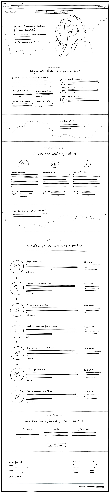

**[← Scenarios Overview](../../00-User-Scenarios.md)** | **[← Project Overview](../../../../README.md)** | **[Trigger Map](../../../B-Trigger-Map/01-Trigger-Map.md)** | **[Change Log](../../../../CHANGELOG.md)**

---

# StartPage Specification - Anna Bansell Consulting

## Design Reference & Sketch Analysis

### Primary Sketch
**Sketch File**: [01-StartPage_Desktop_Concept.jpg](Sketches/01-StartPage_Desktop_Concept.jpg)

### Sketch Details
- **Fidelity Level**: Concept Sketch with detailed layout specifications
- **Platform Focus**: Desktop with responsive considerations noted
- **Last Updated**: 2025-09-02 (includes floating navigation, language switcher, and 7-step methodology)

### Key Design Elements from Sketch
- **Header**: Fixed navigation with floating menu and language switcher
- **Hero Layout**: Split design with content left, portrait right
- **Section Flow**: Logical progression from hero → vision → regional identity → methodology → services → contact
- **Navigation Structure**: Six main navigation points (Home, Turnaround, Uppdrag, Metod, Contact, Language)
- **Excluded Sections**: Småland and informal structure details integrated in content flow but not in main navigation

### Implementation Alignment
This specification document directly reflects the layout, navigation, and content structure depicted in the concept sketch, ensuring pixel-perfect implementation guidance for developers.

## Page Context

### User Scenarios Served
This landing page serves as the primary entry point for three distinct personas:

1. **Nils Netrepreneur** - Business owners/managers evaluating organizational turnaround expertise
   - **Context**: Received tip about Anna, evaluating her as potential interim advisor/consultant
   - **Primary Goal**: Understand Anna's track record and methodology for organizational turnaround
   - **Trust Factors**: Needs to see simple, proven approach with regional cultural alignment

2. **Eva Event-Organizer** - Conference coordinators seeking credible business speakers
   - **Context**: Looking for engaging, credible speaker on organizational transformation
   - **Primary Goal**: Evaluate Anna's speaking credentials and expertise for audiences
   - **Trust Factors**: Needs compelling content and professional presentation skills

3. **Sam Student** - Leadership researchers discovering practical learning resources
   - **Context**: Found Anna through Google search on leadership/organizational topics
   - **Primary Goal**: Learn about practical leadership methodologies and case studies
   - **Trust Factors**: Needs credible, educational content with research value

### Brand Positioning
**Småland Identity**: Core to brand positioning - represents practical, disciplined, hard-to-fool values that build trust with traditional Swedish business leaders.

**Value Proposition**: Focus on how informal corporate structures affect organizational outcomes through proven methodology and regional expertise.

## Header Navigation Specification

*Based on updated sketch design with floating navigation and language switcher components*

### Main Navigation Menu

#### Menu Items and Scroll Targets
*As defined in the [concept sketch](Sketches/01-StartPage_Desktop_Concept.jpg)*

##### 1. Hem (Home)
- **Target**: Hero Section (top of page)
- **Function**: Smooth scroll to page top
- SE: "Hem"
- EN: "Home"

##### 2. Turnaround
- **Target**: Vision Section ("Det går att vända en organisation!")
- **Function**: Smooth scroll to vision/methodology section
- **Label**: "Turnaround" (same in both languages)

##### 3. Uppdrag (Assignments)
- **Target**: Services Section ("Hur kan jag hjälpa dig")
- **Function**: Smooth scroll to services/engagement options
- SE: "Uppdrag"
- EN: "Services"

##### 4. Metod (Method)
- **Target**: Method Section (Seven-Step Process)
- **Function**: Smooth scroll to methodology section
- SE: "Metod"
- EN: "Method"

##### 5. Language Selection
- **Position**: Navigation menu item with globe icon
- **Icon**: Globe symbol to indicate language selection
- **Detection**: Automatic detection based on browser language preferences
- **Default Behavior**: 
  - If browser language = Swedish → Default to "SE"
  - If browser language = English → Default to "EN"  
  - All other languages → Default to "SE" (primary market)
- **Manual Override**: User can manually switch languages, preference saved in session storage
- **Display**: Shows current selected language (Svenska/English) within menu with full language names

##### 6. Contact
- **Position**: Navigation menu item with phone icon
- **Icon**: Phone symbol to indicate contact action
- **Target**: Contact Section (footer area)
- **Function**: Smooth scroll to contact information
- SE: "Kontakt"
- EN: "Contact"

#### Excluded Sections
These sections are present in the page but deliberately excluded from main navigation:
- **Småland Section**: Cultural content integrated in page flow but not a primary navigation destination
- **Vision Section Details**: Informal structure content accessible through main Turnaround navigation

#### Header Design Specifications

##### Layout
- **Position**: Fixed header with floating navigation elements
- **Background**: Transparent or minimal background with smooth transitions
- **Typography**: Clean, professional fonts matching site design
- **Responsiveness**: Adaptive layout for desktop, tablet, and mobile viewports

##### Navigation Behavior
- **Scroll Detection**: Active section highlighting based on scroll position
- **Smooth Scrolling**: Eased scroll transitions between sections (800ms duration)
- **Visual Feedback**: Active state styling for current section
- **Mobile Adaptation**: Hamburger menu for smaller screens with same navigation structure

##### Language Integration
- **Browser Detection**: Automatic language detection on first visit
- **Preference Storage**: Session storage persistence of user language choice
- **Content Switching**: Instant content update without page reload
- **Visual Indicator**: Current selected language shown within navigation menu item with globe icon

## Page Structure Analysis

*The following sections correspond directly to the layout depicted in the [StartPage Desktop Concept sketch](Sketches/01-StartPage_Desktop_Concept.jpg)*

### 1. Hero Section

#### Layout
Split layout with content left, portrait right

#### Primary Headline
- SE: "Framgångskultur på småländska"
- EN: "Success culture the Småland way"

#### Supporting Message
- SE: "En organisation som mår bra, levererar bra. Är det dags att höja blicken, få fram snabba förändringar, samordna de gemensamma processerna och låta organisationen flyga! Som vi gör hemma i Småland!"
- EN: "An organization that feels good, delivers good. Is it time to raise your sights, bring about rapid changes, coordinate common processes and let the organization soar! As we do at home in Småland!"

#### Call-to-Action Question
- SE: "Är du redo för din turnaround?"
- EN: "Are you ready for your turnaround?"

#### Action Button
- SE: "Låt oss prata"
- EN: "Let's talk"
- **Function**: Direct LinkedIn profile link for immediate contact

### 2. Vision Section - "Det går att vända en organisation!"

#### Pre-header
- SE: "Min största insikt:"
- EN: "My greatest insight:"

#### Main Header
- SE: "Det går att vända en organisation!"
- EN: "It's possible to turn around an organization!"

#### Sub-header
- SE: "Nyckeln ligger i den informella strukturen"
- EN: "The key lies in the informal structure"

#### Introduction Text
- SE: "Når förändringarna ända ner till de informella strukturerna? De flesta förändringar i företag sker genom att modifiera och styra om i den formella strukturen. Risken är då att gamla mönster kvarstår och inga större förändringar sker. För att få en beständig förändring behövs modet att se de faktiska faktorer som bromsar organisationen och ger kraft åt de människor som tar företaget till en ny nivå."
- EN: "Do changes reach all the way down to the informal structures? Most changes in companies occur by modifying and redirecting the formal structure. The risk is then that old patterns remain and no major changes occur. To achieve lasting change, we need the courage to see the actual factors that slow down the organization and empower the people who take the company to the next level."

#### Four Core Values (Left Column)

##### Value 1

###### Sub header
- SE: "Ärlighet & omtanke"
- EN: "Honesty & Care"

###### Value text
- SE: "Förtroendet inom gruppen stärks när alla känner och upplever att de behandlas lika."
- EN: "Trust within the group is strengthened when everyone feels and experiences being treated equally."

##### Value 2

###### Sub header
- SE: "Handling istället för rädsla"
- EN: "Action instead of fear"

###### Value text
- SE: "När vi fattar beslut som är långsiktigt hållbara och genomför dem med kraft skapas förtroende och trygghet i organisationen."
- EN: "When we make long-term sustainable decisions and implement them with force, trust and security are created in the organization."

##### Value 3

###### Sub header
- SE: "Värdera varje person"
- EN: "Value every person"

###### Value text
- SE: "Se bortom det uppenbara och se potentialen i varje person utifrån arbetsmiljö och individens egna drivkrafter."
- EN: "See beyond the obvious and see the potential in each person based on work environment and individual motivations."

##### Value 4

###### Sub header
- SE: "Samma bild till alla"
- EN: "Same picture to everyone"

###### Value text
- SE: "När alla har tillgång till samma information samtidigt, kan vi bygga gemensamma värderingar och kraften kan frigöras för tillväxt."
- EN: "When everyone has access to the same information simultaneously, we can build common values and power can be released for growth."

#### Three Outcomes (Right Column)

##### Outcome 1
- SE: "Överträffa försäljningsmål"
- SE: "Gång på gång har jag sett när säljorganisationen har självförtroende och förståelse för processerna hur försäljningen utvecklas och stärks."
- EN: "Exceed sales targets"
- EN: "Time and again I have seen when the sales organization has confidence and understanding of the processes, how sales develops and strengthens."

##### Outcome 2
- SE: "Entusiastiska medarbetare"
- SE: "Med tydligt definierade spelregler blir det både roligt och enkelt att axla ett ansvar och utföra sitt uppdrag."
- EN: "Enthusiastic employees"
- EN: "With clearly defined rules of the game, it becomes both fun and easy to shoulder responsibility and carry out your mission."

##### Outcome 3
- SE: "Värdefulla leveranser"
- SE: "Med en effektiv organisation blir det större marginaler och nöjda kunder vilket leder till en positiv spiral."
- EN: "Valuable deliveries"
- EN: "With an efficient organization, there are greater margins and satisfied customers which leads to a positive spiral."

### 3. Småland Section - Regional Identity

#### Header
- SE: "Småland?"
- EN: "Småland?"

#### Three Carousel Messages

##### Message 1
- SE: "Ihärdighet & Disciplin"
- SE: "Smålänningarna har förstått att framgång nås bäst genom ihärdighet, idogt arbete och disciplin. Vårda tid och resurser är en stabil bas för att få bästa möjliga utfall."
- EN: "Persistence & Discipline"
- EN: "Småland people have understood that success is best achieved through persistence, diligent work and discipline. Caring for time and resources is a stable foundation for achieving the best possible outcome."

##### Message 2
- SE: "Enkelhet & Effektivitet"
- SE: "I Småland värdesätts enkla lösningar som fungerar. Ingen onödig krångel - bara rak kommunikation och praktiska metoder som ger resultat."
- EN: "Simplicity & Efficiency"
- EN: "In Småland, simple solutions that work are valued. No unnecessary complications - just straightforward communication and practical methods that deliver results."

##### Message 3
- SE: "Långsiktigt Tänkande"
- SE: "Småländsk affärsfilosofi bygger på hållbara relationer och långsiktiga investeringar. Det handlar om att bygga något som står sig över tid."
- EN: "Long-term Thinking"
- EN: "Småland business philosophy is built on sustainable relationships and long-term investments. It's about building something that stands the test of time."

### 4. Method Section - Seven-Step Process

#### Pre-header
- SE: "Från ord till handling"
- EN: "Let's get to work"

#### Header
- SE: "Metoden för turnaround som funkar"
- EN: "The method for turnaround that works"

#### Sub-header
- SE: "En systematisk approach för hållbar organisationsförändring"
- EN: "A systematic approach for sustainable organizational transformation"

#### Layout Design
**Vertical Process Flow**: Each step arranged in vertical sequence with connecting navigation arrows

**Three-Column Layout Structure**:
- **Left Column**: Circular icon with blue styling
- **Center Column**: Step title, description, expand/collapse functionality with detailed content
- **Right Column**: "Tänk på det" / "Think about" practical guidance in blue boxes

#### Interactive Features
- **Expand/Collapse Buttons**: "Läs mer" / "Read more" to show detailed expansion content
- **Clickable Navigation Arrows**: Smooth scroll to next step for easy progression
- **Hover Effects**: Visual feedback on interactive elements
- **Individual State Management**: Each step can be expanded independently

#### 7 Steps with Icons (Complete Sequence)

##### Step 1 - 👁️ Raise the Gaze

###### Swedish version

**Sub header:**
"Höja blicken"

**Value text:**
"Grunden för allt förändringsarbete är en tydlig riktning. Här formuleras en gemensam bild av vart vi ska. Tillsammans utforskar vi, tänker dynamiskt, skapar samsyn och mening för att slutligen identifiera nyckelflågor och mål."

**Expansion:**
Det första steget i varje turnaround är att skapa tydlighet kring vart organisationen ska. Anna arbetar med att formulera en gemensam bild som alla kan förstå och känna sig delaktiga i. Detta handlar inte om abstrakta visioner utan om konkreta, uppnåeliga mål som är rotade i verkligheten. Med sin småländska pragmatism fokuserar hon på vad som faktiskt är möjligt att uppnå, inte på vackra ord utan substans.

Genom systematisk utforskning av organisationens potential identifierar Anna de verkliga tillväxtmöjligheterna. Hon använder en dynamisk ansats där hon tillsammans med teamet tänker i spiraler snarare än cirklar - alltid med framåtrörelse som mål. Detta innebär att man vågar ifrågasätta befintliga antaganden och öppnar upp för nya möjligheter som tidigare inte synts.

Slutresultatet av detta steg är en riktning som skapar mening och engagemang i organisationen. Anna säkerställer att alla förstår inte bara vad som ska göras, utan varför det ska göras. Genom att förankra målen i både affärslogik och människors drivkrafter skapas en kraft som bär organisationen framåt även när motgångarna kommer.

**Bullet list:**
Att tänka på:
- Håll målen konkreta och mätbara
- Förankra riktningen i verkligheten
- Skapa delaktighet i visionsarbetet

###### English version

**Sub header:**
"Raise the Gaze"

**Value text:**
"The foundation for all change work is a clear direction. Here a common picture of where we are going is formulated. Together we explore, think dynamically, create consensus and meaning to finally identify key issues and goals."

**Expansion:**
The first step in every turnaround is to create clarity about where the organization is heading. Anna works to formulate a shared vision that everyone can understand and feel part of. This is not about abstract visions but about concrete, achievable goals rooted in reality. With her Småland pragmatism, she focuses on what is actually possible to achieve, not on beautiful words without substance.

Through systematic exploration of the organization's potential, Anna identifies the real growth opportunities. She uses a dynamic approach where she and the team think in spirals rather than circles - always with forward movement as the goal. This means daring to question existing assumptions and opening up to new possibilities that were previously unseen.

The end result of this step is a direction that creates meaning and engagement in the organization. Anna ensures that everyone understands not just what needs to be done, but why it needs to be done. By anchoring the goals in both business logic and people's motivations, a force is created that carries the organization forward even when setbacks come.

**Bullet list:**
Things to Consider:
- Keep goals concrete and measurable
- Anchor direction in reality
- Create participation in vision work

##### Step 2 - 👂 Listen to the People

###### Swedish version

**Sub header:**
"Lyssna in människorna"

**Value text:**
"För att förstå vad som krävs för att lyckas behöver vi förstå nuläget – på riktigt och det görs genom djupgående analys av både hårda och mjuka signaler (t.ex. energi, engagemang, mobbning), gemensam information och insikt. Vi tydliggör också roller och ansvar."

**Expansion:**
Anna förstår att verklig förändring börjar med att förstå nuläget på riktigt, inte som man önskar att det vore. Hon gräver djupt i organisationen för att förstå både de hårda fakta och de mjuka signalerna som berättar sanningen om vad som faktiskt händer. Detta inkluderar allt från energinivåer och engagemang till dolda konflikter och informella maktstrukturer som kan bromsa eller driva utvecklingen.

Genom systematisk analys kartlägger Anna hela organisationens tillstånd. Hon lyssnar inte bara på vad som sägs officiellt, utan förstår vad som händer i korridorerna, vid kaffemaskinen och i de informella nätverken. Med sin erfarenhet av småländsk rakt-på-sak-kommunikation skapar hon trygghet för människor att berätta sanningen, även när den är obehaglig.

Detta djupa lyssnande resulterar i en komplett nulägesanalys som ger rätt grund för alla kommande förändringar. Anna tydliggör också roller och ansvar så att alla vet vad som förväntas av dem. Genom att skapa gemensam information och insikt bygger hon den transparens som krävs för att människor ska våga engagera sig i förändringsarbetet.

**Bullet list:**
Att tänka på:
- Lyssna efter det som inte sägs
- Kartlägg informella maktstrukturer
- Ge exakt samma information till alla

###### English version

**Sub header:**
"Listen to the People"

**Value text:**
"To understand what it takes to succeed, we need to understand the current situation – for real, and this is done through in-depth analysis of both hard and soft signals (e.g. energy, engagement, bullying), shared information and insight. We also clarify roles and responsibilities."

**Expansion:**
Anna understands that real change begins with understanding the current situation for real, not as one wishes it were. She digs deep into the organization to understand both the hard facts and the soft signals that tell the truth about what is actually happening. This includes everything from energy levels and engagement to hidden conflicts and informal power structures that can slow down or drive development.

Through systematic analysis, Anna maps the entire organization's condition. She doesn't just listen to what is said officially, but understands what happens in the corridors, at the coffee machine, and in the informal networks. With her experience of Småland straight-talking communication, she creates safety for people to tell the truth, even when it's uncomfortable.

This deep listening results in a complete current state analysis that provides the right foundation for all upcoming changes. Anna also clarifies roles and responsibilities so everyone knows what is expected of them. By creating shared information and insight, she builds the transparency required for people to dare engage in the change work.

**Bullet list:**
Things to Consider:
- Listen to what is not said
- Map informal power structures
- Share the same picture to everyone

##### Step 3 - ⚡ Quick Obvious Changes

###### Swedish version

**Sub header:**
"Snabba självklara förändringar"

**Value text:**
"Förändring behöver bli synlig snabbt: Därför blir det både snabba och konkreta åtgärder och tydliga symbolhandlingar. Vi fokuserar på det som ger energi och vilja för att samtidigt kunna prioritera det som flyttar fram positionerna mot målet."

**Expansion:**
Anna vet att förändring måste bli synlig snabbt för att människor ska tro på den. Hon identifierar de åtgärder som ger störst synlig effekt med minst möjliga motstånd - de "självklara" förändringarna som alla egentligen vet behöver göras men som av olika anledningar inte blivit genomförda. Dessa snabba vinster bygger momentum och visar att förändring faktiskt är möjlig.

Förutom konkreta åtgärder använder Anna medvetet symbolhandlingar som kommunicerar tydligt att nya tider är här. Detta kan vara allt från att ändra mötesstrukturer till att ta bort onödiga processer som alla irriterat sig på. Varje förändring väljs noggrant för att den ska ge energi och vilja snarare än skapa rädsla eller motstånd.

Genom att fokusera på det som flyttar nålen mot de uppsatta målen skapar Anna en positiv spiral. Människor ser att deras ansträngningar ger resultat, vilket gör dem redo för större förändringar. Med sin småländska praktiskhet prioriterar hon alltid insatser som ger verklig effekt framför aktiviteter som bara ser bra ut på papperet.

**Bullet list:**
Att tänka på:
- Välj enkla förändringar med stor effekt
- Fokusera på självklara förbättringar
- Kommunicera framsteg tydligt

###### English version

**Sub header:**
"Quick Obvious Changes"

**Value text:**
"Change needs to become visible quickly: Therefore, it becomes both quick and concrete measures and clear symbolic actions. We focus on what gives energy and will in order to simultaneously prioritize what moves the positions forward towards the goal."

**Expansion:**
Anna knows that change must become visible quickly for people to believe in it. She identifies the measures that give the greatest visible effect with the least possible resistance - the "obvious" changes that everyone really knows need to be done but which for various reasons have not been implemented. These quick wins build momentum and show that change is actually possible.

In addition to concrete measures, Anna consciously uses symbolic actions that clearly communicate that new times are here. This can be anything from changing meeting structures to removing unnecessary processes that everyone has been annoyed about. Each change is carefully chosen so that it gives energy and will rather than creates fear or resistance.

By focusing on what moves the needle toward the set goals, Anna creates a positive spiral. People see that their efforts produce results, which makes them ready for bigger changes. With her Småland practicality, she always prioritizes efforts that have real effect over activities that just look good on paper.

**Bullet list:**
Things to Consider:
- Choose simple changes with big impact
- Focus on obvious improvements
- Communicate progress clearly

##### Step 4 - 🤝 Form a Community

###### Swedish version

**Sub header:**
"Forma en gemenskap"

**Value text:**
"Här sker det strategiska skiftet: Vi identifierar tillväxtpotential och bromsklossar för att kunna behålla de som bär energi och potential. Samlar insikter för att kunna forma konkreta åtgärder."

**Expansion:**
Detta är steget där Anna gör det verkligt strategiska skiftet från att förstå problemen till att bygga lösningarna. Hon identifierar vilka personer i organisationen som bär energi och potential, och säkerställer att dessa människor får rätt förutsättningar att blomma. Samtidigt hanterar hon de faktorer som håller tillbaka organisationen - det kan vara allt från destruktiva personer till utdaterade processer.

Med sin djupa förståelse för informella strukturer förstår Anna att det är människor, inte processer, som driver verklig förändring. Hon arbetar systematiskt för att frigöra den positiva energin i organisationen samtidigt som hon hanterar de krafter som bromsar utvecklingen. Detta kräver modet att fatta svåra beslut om personer som inte längre passar in i den nya riktningen.

Genom att samla alla insikter från tidigare steg formar Anna konkreta åtgärdsplaner som är både realistiska och ambitiösa. Hon bygger team och skapar strukturer som förstärker den positiva utvecklingen. Resultatet är en fokuserad plan för omställning där rätt människor är på rätt plats för att driva organisationen framåt.

**Bullet list:**
Att tänka på:
- Identifiera energibärare och bromsare
- Våga fatta svåra personalbeslut
- Bygg stöttande strukturer

###### English version

**Sub header:**
"Form a Community"

**Value text:**
"Here the strategic shift takes place: We identify growth potential and obstacles in order to retain those who carry energy and potential. Gather insights to be able to form concrete measures."

**Expansion:**
This is the step where Anna makes the truly strategic shift from understanding the problems to building the solutions. She identifies which people in the organization carry energy and potential, and ensures that these people get the right conditions to flourish. At the same time, she handles the factors that hold back the organization - this can be anything from destructive people to outdated processes.

With her deep understanding of informal structures, Anna understands that it is people, not processes, that drive real change. She works systematically to release the positive energy in the organization while handling the forces that slow down development. This requires the courage to make difficult decisions about people who no longer fit into the new direction.

By gathering all insights from previous steps, Anna forms concrete action plans that are both realistic and ambitious. She builds teams and creates structures that strengthen the positive development. The result is a focused plan for transformation where the right people are in the right place to drive the organization forward.

**Bullet list:**
Things to Consider:
- Identify energy drivers and blockers
- Dare to make difficult people decisions
- Build supporting structures

##### Step 5 - ⚙️ Common Processes

###### Swedish version

**Sub header:**
"Gemensamma processer"

**Value text:**
"För att förändring ska hålla måste den bli vardag så snabbt som möjligt: Därför skapar vi enkla, smarta arbetsflöden, automatiserar och delegerar, eliminerar det som stör. Sist men inte minst skapas forum för synlig framgång."

**Expansion:**
För Anna är det avgörande att förändringen inte bara sker utan att den också håller över tid. Hon förstår att för att förändring ska bli bestående måste den bli en naturlig del av vardagen så snabbt som möjligt. Detta innebär att skapa enkla, smarta arbetsflöden som människor faktiskt vill använda - inte komplicerade system som bara skapar frustration.

Med sin småländska effektivitetstänk arbetar Anna systematiskt för att automatisera det som kan automatiseras och delegera det som kan delegeras. Hon eliminerar allt som stör och skapar merarbete utan att tillföra värde. Samtidigt bygger hon strukturer som gör det enkelt för människor att göra rätt saker på rätt sätt.

Anna säkerställer att framgångar blir synliga för alla i organisationen. Hon skapar forum där bra resultat kan lyftas fram och firas, vilket förstärker de beteenden som leder framåt. Genom att göra framgång synlig och påtaglig bygger hon en kultur där alla vill vara en del av den positiva utvecklingen.

**Bullet list:**
Att tänka på:
- Skapa processer människor vill använda
- Automatisera rutinuppgifter
- Bygg in framgångsfirande

###### English version

**Sub header:**
"Common Processes"

**Value text:**
"For change to last, it must become everyday as quickly as possible: Therefore, we create simple, smart workflows, automate and delegate, eliminate what disturbs. Last but not least, forums for visible success are created."

**Expansion:**
For Anna, it is crucial that the change not only happens but also lasts over time. She understands that for change to become lasting, it must become a natural part of everyday life as quickly as possible. This means creating simple, smart workflows that people actually want to use - not complicated systems that just create frustration.

With her Småland efficiency thinking, Anna works systematically to automate what can be automated and delegate what can be delegated. She eliminates everything that disturbs and creates extra work without adding value. At the same time, she builds structures that make it easy for people to do the right things in the right way.

Anna ensures that successes become visible to everyone in the organization. She creates forums where good results can be highlighted and celebrated, which reinforces the behaviors that lead forward. By making success visible and tangible, she builds a culture where everyone wants to be part of the positive development.

**Bullet list:**
Things to Consider:
- Create processes people want to use
- Automate routine tasks
- Build in success celebration

##### Step 7 - 🚀 Let the Organization Fly

###### Swedish version

**Sub header:**
"Låt organisationen flyga"

**Value text:**
"Nu gäller det att hålla i och förstärka: Här bygger vi vanor och förväntningar i vardagen och utmed vägen premierar vi rätt beteenden. Resultat: En ny kultur börjar ta form – i praktiken."

**Expansion:**
I det sjunde och sista steget av Annas metod handlar det om att bygga ihop allt till en sammanhängande kultur som fungerar utan extern styrning. Hon arbetar systematiskt för att skapa vanor och förväntningar som blir en naturlig del av vardagen. Det handlar om att premirera rätt beteenden så konsekvent att de blir organisationens nya normaltillstånd.

Anna förstår att verklig framgång kommer när organisationen kan driva sig själv framåt. Hon bygger ledarskap på alla nivåer så att den nya kulturen inte är beroende av enskilda personer. Med sin småländska långsiktighet fokuserar hon på att skapa strukturer och beteenden som står sig över tid, även när yttre förutsättningar förändras.

Slutresultatet är en organisation som inte bara fungerar utan som kontinuerligt utvecklas och förbättras på egen hand. Anna har byggt en kultur där människor tar ansvar, driver utveckling och levererar resultat eftersom det känns naturligt och meningsfullt. Organisationen har fått både riktning och förmåga att navigera framtida utmaningar själv.

**Bullet list:**
Att tänka på:
- Bygg ledarskap på alla nivåer
- Skapa system som förstärker beteenden
- Säkerställ fortsatt utveckling

###### English version

**Sub header:**
"Let the Organization Fly"

**Value text:**
"Now it's about holding on and strengthening: Here we build habits and expectations in everyday life and along the way we reward the right behaviors. Result: A new culture begins to take shape – in practice."

**Expansion:**
In the seventh and final step of Anna's method, it's about building everything together into a cohesive culture that functions without external control. She works systematically to create habits and expectations that become a natural part of everyday life. It's about rewarding the right behaviors so consistently that they become the organization's new normal state.

Anna understands that real success comes when the organization can drive itself forward. She builds leadership at all levels so that the new culture is not dependent on individual people. With her Småland long-term thinking, she focuses on creating structures and behaviors that stand the test of time, even when external conditions change.

The end result is an organization that not only functions but continuously develops and improves on its own. Anna has built a culture where people take responsibility, drive development and deliver results because it feels natural and meaningful. The organization has gained both direction and the ability to navigate future challenges independently.

**Bullet list:**
Things to Consider:
- Build leadership at all levels
- Create behavior-reinforcing systems
- Ensure continued development

##### Step 6 - 📈 Sales Organization Excellence

###### Swedish version

**Sub header:**
"Säljorganisation som levererar"

**Value text:**
"En stark säljorganisation är ofta nyckeln till bestående framgång. När säljteamet har självförtroende, tydliga processer och rätt verktyg blir försäljningen en naturlig del av organisationens tillväxtmotor."

**Expansion:**
Anna förstår att en effektiv säljorganisation inte bara handlar om individuella säljare utan om hela systemet som stöttar dem. Hon arbetar systematiskt för att bygga en säljkultur där alla förstår sin roll i försäljningsprocessen - från första intryck till långsiktig kundrelation. Med sin småländska praktiskhet fokuserar hon på att skapa enkla, tydliga processer som gör det lätt att sälja.

Genom att kartlägga hela kundresan och identifiera var i processen som energi går förlorad eller där kunder hoppar av, skapar Anna strukturer som förstärker framgången. Hon bygger system för kunskapsdelning inom säljteamet så att bästa praxis sprids naturligt. Samtidigt säkerställer hon att säljorganisationen har rätt verktyg och den information de behöver för att vara trovärdiga och professionella i varje kundmöte.

Slutresultatet är en säljorganisation som inte bara når sina mål utan som konsekvent överträffar dem. Anna skapar en miljö där säljarna känner sig stöttade och trygga, vilket leder till äkta entusiasm som kunderna känner av. När hela organisationen förstår hur de bidrar till försäljningsframgången blir det en naturlig del av företagskulturen att alla hjälper till att skapa värde för kunderna.

**Bullet list:**
Att tänka på:
- Kartlägg hela kundresan
- Bygg kunskapsdelningssystem
- Engagera hela organisationen

###### English version

**Sub header:**
"Sales Organization Excellence"

**Value text:**
"A strong sales organization is often the key to lasting success. When the sales team has confidence, clear processes and the right tools, sales becomes a natural part of the organization's growth engine."

**Expansion:**
Anna understands that an effective sales organization is not just about individual salespeople but about the entire system that supports them. She works systematically to build a sales culture where everyone understands their role in the sales process - from first impression to long-term customer relationship. With her Småland practicality, she focuses on creating simple, clear processes that make it easy to sell.

By mapping the entire customer journey and identifying where in the process energy is lost or where customers drop off, Anna creates structures that reinforce success. She builds systems for knowledge sharing within the sales team so that best practices spread naturally. At the same time, she ensures that the sales organization has the right tools and information they need to be credible and professional in every customer meeting.

The end result is a sales organization that not only reaches its goals but consistently exceeds them. Anna creates an environment where salespeople feel supported and secure, which leads to genuine enthusiasm that customers can sense. When the entire organization understands how they contribute to sales success, it becomes a natural part of the company culture for everyone to help create value for customers.

**Bullet list:**
Things to Consider:
- Map the entire customer journey
- Build knowledge sharing systems
- Engage the entire organization

#### Technical Implementation Specifications

##### Component Structure
- **Framework**: React functional component with TypeScript
- **State Management**: useState for expand/collapse functionality per step
- **Animation**: CSS transitions and Tailwind animations for smooth interactions
- **Navigation**: Smooth scroll behavior with scroll-into-view API

##### Interactive Elements
- **Expand Buttons**: 
  - SE Text: "Läs mer" → "Visa mindre"
  - EN Text: "Read more" → "Show less"
  - Icons: ChevronDown ↔ ChevronUp
  - Styling: Blue color scheme with hover effects

- **Navigation Arrows**:
  - Function: Scroll to next step using element IDs
  - Hover Effects: Arrow movement animation + tooltip
  - Tooltips: "Nästa steg" / "Next step"
  - Visual Feedback: Color transition and transform animations

##### Responsive Design
- **Desktop**: Three-column grid layout (1-7-4 columns)
- **Mobile**: Single-column stacked layout with maintained functionality
- **Breakpoints**: lg:grid-cols-12 for responsive behavior

##### Content Structure
Each step includes:
- **Icon**: Circular blue container with emoji
- **Title**: Bilingual step name
- **Description**: Core methodology explanation
- **Expand Content**: Detailed expansion text in gray boxes
- **Think About**: Practical bullet points in blue boxes

**Handoff Conclusion**:
- SE: "När förändringen är på plats är det dags att släppa taget:"
- SE: "Lämna över ansvaret till organisationen"  
- SE: "Säkerställa att det nya fungerar utan extern kraft"
- SE: "Resultat: Självdrivande organisation med förnyad riktning och förmåga."
- EN: "When the change is in place, it's time to let go:"
- EN: "Hand over responsibility to the organization"
- EN: "Ensure that the new works without external force" 
- EN: "Result: Self-driving organization with renewed direction and capability."

### 5. Services Section

#### Header
- SE: "Hur kan jag hjälpa dig i din Turnaround"
- EN: "How can I help you in your Turnaround"

#### Three Service Options

##### Service 1 - Mentor
- SE: "Mentor"
- SE: "Långsiktig utvecklingspartner för ledningsgrupper som vill bygga hållbar förändring. Tillsammans skapar vi strategier och verktyg för att stärka organisationens informella strukturer."
- SE: "Perfekt när du behöver kontinuerlig stöttning genom hela förändringsresan."
- EN: "Mentor"
- EN: "Long-term development partner for management teams wanting to build sustainable change. Together we create strategies and tools to strengthen the organization's informal structures."
- EN: "Perfect when you need continuous support throughout the entire change journey."

##### Service 2 - Interim
- SE: "Interim"
- SE: "Operativ ledare som kliver in och driver förändringsarbetet inifrån organisationen. Jag tar ansvar för genomförandet medan jag bygger intern kapacitet för framtiden."
- SE: "Rätt val när du behöver snabba resultat och samtidigt utveckla ditt team."
- EN: "Interim"
- EN: "Operational leader who steps in and drives change work from within the organization. I take responsibility for implementation while building internal capacity for the future."
- EN: "Right choice when you need rapid results while developing your team."

##### Service 3 - Speaker
- SE: "Föreläsare"
- SE: "Inspirerande föredrag om organisationsförändring med fokus på praktiska metoder och småländska värderingar. Delar verkliga case och konkreta verktyg."
- SE: "Ideal för konferenser, ledningsgrupper och utbildningsprogram som vill ha äkta innehåll."
- EN: "Speaker"
- EN: "Inspiring presentations on organizational change focusing on practical methods and Småland values. Shares real cases and concrete tools."
- EN: "Ideal for conferences, management teams and training programs that want authentic content."

#### Call-to-Action Button
- SE: "Kontakta mig"
- EN: "Contact me"

### 6. Contact Section - Footer

**Implementation Status**: ✅ **Well-Implemented** - Current React component provides excellent user experience

#### Current Implementation Analysis
The Footer7 component delivers professional, responsive design with effective Småland branding

#### Implementation Highlights ✅

##### Excellent Features Already Working
- **LinkedIn Integration**: Direct link to https://www.linkedin.com/in/annabansell with proper external link handling
- **Småland Branding**: "Genuin framgångskultur på småländska" perfectly captures regional identity
- **Professional Structure**: Clean three-column navigation layout with brand section
- **Swedish Content**: Authentic language throughout all sections
- **Responsive Design**: Adaptive layout from mobile to desktop
- **Accessibility**: Proper ARIA labels, semantic HTML, and keyboard navigation
- **Visual Design**: Warm brown color scheme (warmBrown-50/200/600/700) matching Småland aesthetic
- **Interactive Elements**: Smooth hover transitions and professional link styling

##### Technical Implementation Excellence
- **Component Architecture**: Well-structured React/TypeScript with configurable props
- **Styling System**: Consistent Tailwind CSS classes with custom warmBrown palette
- **Code Quality**: Clean, maintainable code structure with proper prop interfaces

#### Layout Structure
Multi-column responsive layout with brand section left, navigation links right

#### Contact Information

##### Personal Branding
- SE: "Anna Bansell"
- EN: "Anna Bansell"

##### Professional Title
- SE: "Organisationskonsult & Turnaround-specialist"
- EN: "Organizational Consultant & Turnaround Specialist"

##### Regional Identity
- SE: "Småland, Sverige"
- EN: "Småland, Sweden"

#### Contact Methods

##### Primary Contact - LinkedIn
- **Platform**: LinkedIn Professional Profile
- **URL**: https://www.linkedin.com/in/annabansell/
- **Link Text**:
  - SE: "Kontakta mig på LinkedIn"
  - EN: "Contact me on LinkedIn"
- **Function**: External link opening in new tab
- **Priority**: Primary contact method for professional inquiries

##### Secondary Contact Information
- **Email Display**: Contact form or professional email address
- **Label**:
  - SE: "E-post för förfrågningar"
  - EN: "Email for inquiries"

##### Location Information
- **Business Location**:
  - SE: "Baserad i Småland"
  - EN: "Based in Småland"
- **Service Area**:
  - SE: "Tjänster i hela Sverige"
  - EN: "Services throughout Sweden"

#### Footer Navigation

##### Quick Links Section
- **Header**:
  - SE: "Snabblänkar"
  - EN: "Quick Links"

##### Navigation Items
- **Home Link**:
  - SE: "Hem"
  - EN: "Home"
  - **Function**: Smooth scroll to top of page

- **Method Link**:
  - SE: "Metod"
  - EN: "Method"
  - **Function**: Smooth scroll to methodology section

- **Services Link**:
  - SE: "Tjänster"
  - EN: "Services"
  - **Function**: Smooth scroll to services section

- **About Link**:
  - SE: "Om Anna"
  - EN: "About Anna"
  - **Function**: Smooth scroll to vision section

#### Professional Credentials

##### Expertise Areas
- **Header**:
  - SE: "Expertområden"
  - EN: "Areas of Expertise"

##### Specializations List
- **Turnaround Management**:
  - SE: "Turnaround-ledning"
  - EN: "Turnaround Management"

- **Organizational Change**:
  - SE: "Organisationsförändring"
  - EN: "Organizational Change"

- **Interim Leadership**:
  - SE: "Interim-ledning"
  - EN: "Interim Leadership"

- **Sales Organization**:
  - SE: "Säljorganisation"
  - EN: "Sales Organization"

#### Business Information

##### Service Delivery
- **Header**:
  - SE: "Tjänsteutbud"
  - EN: "Service Offerings"

##### Service Types
- **Consulting**:
  - SE: "Rådgivning"
  - EN: "Consulting"

- **Interim Roles**:
  - SE: "Interim-uppdrag"
  - EN: "Interim Assignments"

- **Speaking**:
  - SE: "Föreläsningar"
  - EN: "Speaking"

#### Footer Bottom

##### Copyright Information
- **Text**:
  - SE: "© 2024 Anna Bansell. Alla rättigheter förbehållna."
  - EN: "© 2024 Anna Bansell. All rights reserved."

##### Regional Tagline
- **Message**:
  - SE: "Framgångskultur på småländska"
  - EN: "Success culture the Småland way"

#### Technical Implementation

##### Component Architecture
- **Framework**: React functional component with TypeScript
- **Styling**: Tailwind CSS with responsive grid layout
- **Structure**: Multi-column layout adapting to screen size

##### Responsive Design
- **Desktop**: Four-column layout with full information display
- **Tablet**: Two-column layout with condensed information
- **Mobile**: Single-column stacked layout with collapsible sections

##### Interactive Elements
- **LinkedIn Button**: Primary CTA with hover effects and external link icon
- **Navigation Links**: Smooth scroll functionality matching header navigation
- **Contact Information**: Click-to-copy functionality for email addresses

##### Accessibility Features
- **Screen Reader Support**: Proper ARIA labels and semantic HTML structure
- **Keyboard Navigation**: Tab order optimization for all interactive elements
- **Focus States**: Clear visual indicators for all focusable elements
- **Color Contrast**: High contrast text meeting WCAG guidelines

##### Visual Design
- **Background**: Warm earth tone matching Småland aesthetic
- **Typography**: Consistent with site font hierarchy
- **Spacing**: Generous padding and margins for readability
- **Dividers**: Subtle visual separation between footer sections

## Interactions and Effects

### Navigation Behavior

#### Floating Navigation
- **Position**: Fixed floating menu positioned in top-right corner of viewport
- **Design**: Circular/rounded floating element with expandable menu
- **Sections**: Home, Turnarounds, Uppdrag, Metod (linking to respective page sections)
- **Behavior**: Remains visible during scroll, smooth transitions on expand/collapse
- **Accessibility**: Clear focus states and keyboard navigation support

#### Navigation Features
- **Smooth scrolling**: Implemented between sections for seamless one-page experience
- **Section highlighting**: Navigation updates to show current section
- **Sticky behavior**: Floating navigation remains accessible during scroll
- **Light gray hover effect**: Subtle visual feedback for menu item interactions
- **Stable menu width**: Consistent sizing prevents cursor misalignment during language switches
- **Dynamic cursor tracking**: Hover cursor accurately follows menu items with recalculation on layout changes
- **Smooth language transitions**: Subtle animation prevents content jumping during language switching
- **Delayed hover fade**: Gray marker remains briefly after language click before smooth fade-out
- **Visual state separation**: Clear distinction between selected state and hover state indicators
- **Menu item spacing**: Refined gaps between menu items for proper visual balance and click targeting
- **Navigation flow optimization**: Language selection positioned after contact to maintain logical navigation sequence
- **Compact navigation design**: Menu items sized efficiently without excess spacing for clean, professional appearance

#### Language Selection Integration
- **Position**: Integrated as navigation menu item with globe icon
- **Design**: Menu item displaying current language (Svenska/English) with globe icon
- **Functionality**: Click interaction within navigation menu for language switching
- **Content Storage**: All content stored in frontend code with language keys
- **Behavior**: Instant language switching without page reload
- **Visual Indication**: Current selected language shown within menu item
- **Icon**: Globe symbol to indicate language functionality
- **Default**: Browser language detection with fallback to Swedish (SE)
- **Persistence**: Remember user's language choice in session storage

### Primary Interactions
- **LinkedIn CTA**: Direct external link to Anna's LinkedIn profile (https://www.linkedin.com/in/annabansell)
- **Contact buttons**: Smooth scroll to contact section
- **Carousel navigation**: Previous/next controls for Småland section
- **Method section expand/collapse**: "Läs mer" / "Read more" buttons to reveal detailed methodology content
- **Method navigation arrows**: Clickable arrows for smooth scrolling between methodology steps
- **Step-by-step progression**: Interactive navigation through 7-step turnaround process

### Visual Feedback
- **Button hover states**: Warm gradient effects on all CTAs with shadow transitions
- **Card hover effects**: Subtle shadow and scale effects on service cards
- **Smooth transitions**: CSS transitions for good user experience
- **Loading animations**: Fade-in animations for section content
- **Method expand animations**: Smooth slide-in animations for expanded methodology content
- **Arrow hover effects**: Visual feedback with arrow movement and tooltip display on methodology navigation
- **Step progression indicators**: Visual state changes for expanded/collapsed methodology steps
- **Interactive color transitions**: Blue color scheme transitions on methodology interactive elements

## Content Strategy & Bilingual Implementation

### Content Prioritization

#### Primary Language
Swedish (SE) - Target market is Swedish business leaders

#### Secondary Language
English (EN) - International accessibility and business development

### Messaging Hierarchy
1. **Regional Positioning**: Småland identity as trust builder
2. **Methodology Focus**: "Informal corporate structures" as unique differentiator  
3. **Practical Results**: Outcome-focused rather than process-heavy
4. **Personal Connection**: Direct LinkedIn contact for relationship building

### Content Sections Overview

#### Hero Section
Brand positioning and primary conversion
- Focus: Regional identity + practical methodology
- CTA: Direct LinkedIn contact for immediate relationship building

#### Vision Section
Core methodology and business outcomes
- Focus: Informal vs formal structure differentiation
- Content: 4 values + 3 proven outcomes with specific results

#### Småland Section
Cultural positioning and trust building
- Focus: Regional business philosophy as competitive advantage
- Content: 3 rotating messages about Småland business values

#### Method Section  
Interactive seven-step turnaround methodology
- Focus: Systematic approach with practical implementation including sales excellence
- Layout: Vertical process flow with three-column design (icon, content, practical guidance)
- Interactions: Expand/collapse functionality and clickable navigation arrows
- Content: Complete process from vision to sales organization to handoff with detailed expansion content
- Features: "Läs mer" / "Read more" buttons, smooth step-to-step navigation, bilingual support

#### Services Section
Engagement options and final conversion
- Focus: Three service delivery methods
- CTA: Contact button for consultation initiation

### Visual Design Elements

#### Color Scheme
Warm browns and earth tones reflecting Småland aesthetics

#### Typography
Clean, professional fonts supporting Swedish and English text

#### Layout
Responsive grid system optimizing for desktop and mobile

#### Visual Hierarchy
Clear section separation with consistent spacing

---

**For technical implementation details, architecture overview, and development status, see [Product Brief - Technical Implementation Section](../../A-Product-Brief/01-Product-Brief.md#technical-implementation)**
