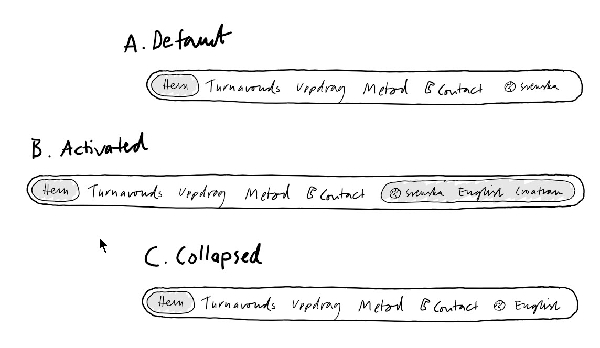

**[← 1.1 StartPage](../1.1-StartPage/1.1-StartPage.md)** | **[→ 1.3 StartPage Mobile](../1.3-StartPage-Mobile/1.3-StartPage-Mobile.md)**

---

# Desktop Language Selector Specification - Anna Bansell Consulting

## Design Reference & Sketch Analysis

### Primary Sketch
**Sketch File**: [StartPage-Multi-Language_Desktop_Concept.jpg](Sketches/StartPage-Multi-Language_Desktop_Concept.jpg)

**[← 1.1 StartPage](../1.1-StartPage/1.1-StartPage.md)** | **[→ 1.3 StartPage Mobile](../1.3-StartPage-Mobile/1.3-StartPage-Mobile.md)**

### Sketch Details
- **Fidelity Level**: Concept Sketch showing three states of desktop language selector
- **Platform Focus**: Desktop navigation integration
- **Last Updated**: 2025-01-27 (shows Default, Activated, and Collapsed states)

### Key Design Elements from Sketch
- **Three States**: Default, Activated, and Collapsed desktop language selector states
- **Language Options**: Swedish (svenska), English, and Croatian
- **Visual Design**: Globe icon with light gray background highlighting
- **Desktop Integration**: Positioned on far right of horizontal navigation bar
- **State Transitions**: Clear visual feedback between different interaction states

### Implementation Alignment
This specification document directly reflects the three-state desktop language selector design depicted in the concept sketch, ensuring pixel-perfect implementation guidance for developers.

## Page Context

### User Scenarios Served
This desktop language selector component serves all website visitors by providing:

1. **Language Accessibility** - Users can access content in their preferred language
2. **Navigation Continuity** - Language switching maintains current page context
3. **International Reach** - Enables Swedish, English, and Croatian language support
4. **User Preference** - Remembers language choice during session

### Brand Positioning
**Multi-Language Support**: Essential for reaching both Swedish business leaders and international markets, reflecting Anna's global consulting approach while maintaining strong regional identity.

**Desktop User Experience**: Seamless language switching without losing navigation context or page position, optimized for desktop interaction patterns.

## Desktop Language Selector Component Specification

*Based on three-state design from [concept sketch](Sketches/1.2-StartPage-Mobile_Mobile_Concept.jpg)*

### Component States

#### State A - Default State
- **Visual Design**: Compact horizontal layout with globe icon and current language
- **Current Language**: "svenska" displayed as default
- **Background**: Light gray highlighting to indicate interactive element
- **Position**: Far right of navigation bar
- **Interaction**: Click to activate expanded state with smooth slide-out animation

#### State B - Activated State  
- **Visual Design**: Expanded container showing all available language options
- **Language Options**: 
  - Globe icon + "svenska"
  - "English" 
  - "Croatian"
- **Background**: Light gray highlighting to indicate active state
- **Animation**: Smooth slide-out transition from compact to expanded state
- **Interaction**: Click on desired language to select and trigger smooth slide-in collapse

#### State C - Collapsed State
- **Visual Design**: Returns to compact horizontal layout
- **Selected Language**: Shows newly selected language (e.g., "English")
- **Background**: Light gray highlighting maintained
- **Animation**: Smooth slide-in transition from expanded to compact state
- **Behavior**: Language change triggers content update, maintains page context

### Navigation Integration

#### Position in Navigation Bar
- **Location**: Far right of horizontal navigation bar
- **Layout**: After main menu items (Hem, Turnavonds, Uppdrag, Metod, Contact)
- **Spacing**: Consistent with other navigation elements

#### Visual Design Specifications
- **Container**: Rounded rectangle matching navigation bar design
- **Icon**: Globe symbol to indicate language functionality
- **Typography**: Consistent with main navigation font and sizing
- **Background**: Light gray (#f5f5f5) for active/selected states
- **Transitions**: Smooth animations between states

### Language Options

#### Available Languages
- **Svenska**: Default language for primary market (Swedish)
- **English**: International accessibility and business development
- **Hrvatski**: Additional language support for specific markets (Croatian)

**Language Display Convention**: All language names are displayed in their local language form, regardless of the currently selected interface language.

#### Language Detection
- **Browser Detection**: Automatic detection based on browser language preferences
- **Default Behavior**: 
  - If browser language = Swedish → Default to "svenska"
  - If browser language = English → Default to "English"  
  - All other languages → Default to "svenska" (primary market)
- **Manual Override**: User can manually switch languages, preference saved in session storage

### Desktop Interaction Behavior

#### Trigger Actions
- **Click Interaction**: Click on language selector to activate expanded state
- **Hover State**: Visual feedback on hover before activation
- **Keyboard Navigation**: Tab order support for accessibility

#### State Transitions
- **Default → Activated**: Smooth slide-out animation revealing all language options
- **Activated → Collapsed**: Smooth slide-in animation with language update and content refresh
- **Language Change**: Instant content update without page reload
- **Context Preservation**: Maintains current page position and navigation state

#### Desktop User Feedback
- **Visual Highlighting**: Clear indication of active/selected states with hover effects
- **Smooth Animations**: CSS transitions optimized for desktop interaction patterns
- **Immediate Response**: Instant visual feedback on user interactions
- **State Persistence**: Selected language remains active until manually changed

## Technical Implementation

### Component Architecture
- **Framework**: React functional component with TypeScript
- **State Management**: useState for language selection and component states
- **Styling**: Tailwind CSS with responsive design classes
- **Animation**: CSS transitions for smooth state changes

### Language System Integration
- **Content Storage**: All content stored in frontend code with language keys
- **Context Provider**: LanguageContext for global language state management
- **Content Switching**: Instant content update without page reload
- **Session Storage**: User language preference persistence

### Desktop Design Specifications
- **Desktop Focus**: Full three-state interaction with hover effects
- **Layout Integration**: Seamless integration with horizontal navigation bar
- **Interaction Patterns**: Click-based activation with hover feedback
- **Visual Hierarchy**: Consistent with desktop navigation design language

### Accessibility Features
- **Keyboard Navigation**: Tab order and keyboard interaction support
- **Screen Reader**: Proper ARIA labels and semantic HTML structure
- **Focus Indicators**: Clear visual feedback for keyboard users
- **Language Labels**: Descriptive text for assistive technologies

## Content Requirements

### Language-Specific Content
- **Swedish Content**: Primary language with full content coverage
- **English Content**: Complete translation of all Swedish content
- **Croatian Content**: Key content translated for Croatian market

### Visual Elements
- **Globe Icon**: Universal symbol for language selection
- **Language Labels**: Clear, readable text for each language option
- **State Indicators**: Visual feedback for current selection and interaction states

## Success Criteria
- Users can easily identify current selected language on desktop
- Language switching is intuitive and responsive for desktop users
- Visual feedback is clear and immediate for desktop interactions
- Component maintains consistent behavior within desktop navigation
- Accessibility standards are met for keyboard and screen reader users
- Language changes persist during user session
- Content updates instantly without page reload
- Hover states provide clear interaction feedback

## Related Components
- Main desktop navigation menu (integration point)
- Page content components (language-specific rendering)
- Language context provider (global state management)
- Desktop layout system (navigation integration)

---

**For technical implementation details, architecture overview, and development status, see [Product Brief - Technical Implementation Section](../../A-Product-Brief/01-Product-Brief.md#technical-implementation)**
