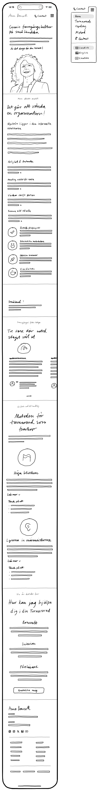

**Previous Step**: ← [Multi-Language Selector](../1.2-Multi-Language-Selector/1.2-Multi-Language-Selector.md)

### 1.3 StartPage Mobile

**Previous Step**: ← [Multi-Language Selector](../1.2-Multi-Language-Selector/1.2-Multi-Language-Selector.md)

# 1.3 StartPage Mobile

## Base Specification Reference

**Primary Specification**: [1.1-StartPage Desktop](../1.1-StartPage/1.1-StartPage.md)

This mobile specification defines only the **differences** and **mobile-specific adaptations** from the desktop version. All content, functionality, and features from the desktop specification apply unless explicitly modified below.

## Design Reference & Sketch Analysis

### Primary Sketch
**Sketch File [ID: mobile-sketch-file-concept]**: [1.3-StartPage-Mobile_Mobile_Concept.jpg](Sketches/1.3-StartPage-Mobile_Mobile_Concept.jpg)

### Mobile-Specific Design Changes
- **Navigation [ID: mobile-nav-change]**: Desktop floating navigation → Hamburger menu system
- **Hero Layout [ID: mobile-hero-change]**: Desktop split layout → Single-column vertical stack
- **Content Flow [ID: mobile-content-change]**: Desktop multi-column → Single-column progression
- **Interactions [ID: mobile-interaction-change]**: Desktop hover states → Touch-optimized interactions

## Mobile-Specific User Behavior

### Key Behavioral Differences from Desktop
- **Attention Span**: 40% shorter engagement time requiring immediate value presentation
- **Navigation Pattern**: Thumb-based scrolling vs cursor-based exploration
- **Contact Preference**: Direct tap-to-contact vs form-based inquiries
- **Content Consumption**: Scan-first approach vs detailed reading patterns

## Key Mobile Navigation Changes

### Navigation System [ID: mobile-navigation-system]
**Desktop**: Floating navigation with inline language selector  
**Mobile**: Hamburger menu with slide-out navigation drawer

#### Hamburger Menu Implementation [ID: mobile-hamburger-implementation]
- **Header**: 64px fixed header with brand logo and hamburger icon
- **Menu Structure**: Full-height slide-out from right side 
- **Touch Targets**: Minimum 44px for all interactive elements
- **Language Selector**: Integrated within hamburger menu instead of separate component

#### Mobile-Specific Navigation Behavior [ID: mobile-nav-behavior]
- **Animation**: 300ms slide-in transition with backdrop overlay
- **Accessibility**: ARIA labels and keyboard navigation support
- **Close Methods**: Tap overlay, swipe right, or hamburger icon

## Key Layout Changes by Section

### 1. Hero Section Changes [ID: mobile-hero-changes]
**Desktop**: Split layout with content left, portrait right  
**Mobile**: Single-column vertical stack with portrait at top

- **Portrait Position**: Top center instead of right side
- **Typography**: Larger touch-friendly sizing
- **Action Button Removal**: Orange "Let's talk" action button (ID: hero-action-lets-talk) is **removed** from mobile version
- **Rationale**: Simplified mobile experience focusing on content consumption; contact available via navigation menu

### 2. Vision Section Changes [ID: mobile-vision-changes]
**Desktop**: Split layout with illustration right  
**Mobile**: Single-column with portrait at top

- **Layout**: All content stacked vertically instead of side-by-side
- **Values Display**: Expandable cards instead of grid layout
- **Outcomes**: Single-column list instead of three-column grid

### 3. Småland Section Changes [ID: mobile-smaland-changes]
**Desktop**: Three-column message display  
**Mobile**: Horizontal swipe carousel with dot indicators

- **Interaction**: Touch swipe instead of hover states
- **Auto-rotate**: 5-second intervals with pause on touch
- **Navigation**: Dot indicators at bottom instead of side arrows

### 4. Cases Section Changes [ID: mobile-cases-changes]  
**Desktop**: Three-column grid layout  
**Mobile**: Vertical card stack with expandable testimonials

- **Layout**: Single-column progression instead of side-by-side
- **Testimonials**: Tap to expand instead of always visible
- **Cards**: Full-width instead of constrained columns

### 5. Method Section Changes [ID: mobile-method-changes]
**Desktop**: Multi-column step layout with sidebar navigation  
**Mobile**: Vertical accordion with step-by-step progression

- **Navigation**: Previous/Next buttons instead of step jumping
- **Expansion**: Tap to expand each step instead of hover
- **Progress**: Visual progress indicator showing current step

## Mobile-Specific Technical Requirements

### Performance Standards [ID: mobile-performance-standards]
- **First Contentful Paint**: < 1.5 seconds on 3G connection
- **Touch Targets**: Minimum 44px for all interactive elements  
- **Font Size**: Minimum 16px for body text to prevent zoom
- **Image Optimization**: WebP format with JPEG fallback, responsive srcset

### Touch Interactions [ID: mobile-touch-interactions]
- **Swipe Gestures**: Horizontal for carousels, vertical for scrolling
- **Touch Feedback**: Visual response within 16ms of interaction
- **Scroll Momentum**: Native iOS/Android scrolling behavior
- **Pull-to-Refresh**: Optional for dynamic content sections

### Mobile-Specific Features [ID: mobile-specific-features]
- **Progressive Web App**: Add-to-home-screen capability
- **Offline Support**: Core content cached for offline viewing
- **Device Integration**: Safe area support for notched devices
- **Accessibility**: Full screen reader and keyboard navigation support

---

**For content details, see [1.1-StartPage Desktop Specifications](../1.1-StartPage/1.1-StartPage.md) - All content, testimonials, method steps, and services are identical to desktop version.**

---

## WPS2C Attribution

*This documentation was created using the WhitePort Sketch-to-Code (WPS2C) methodology, ensuring comprehensive specification coverage, systematic object identification, and professional implementation guidance. WPS2C methodology focuses on bridging the gap between design intention and technical implementation through detailed, traceable documentation standards.*

*All specifications include unique object identification systems enabling precise implementation tracking and quality assurance throughout the development process.*
